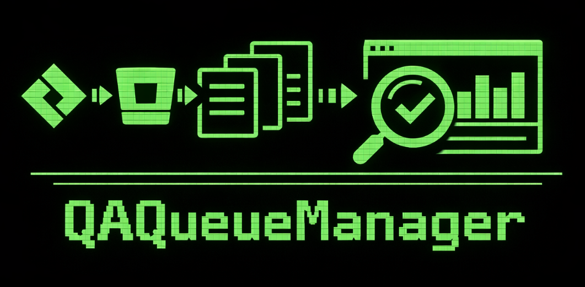
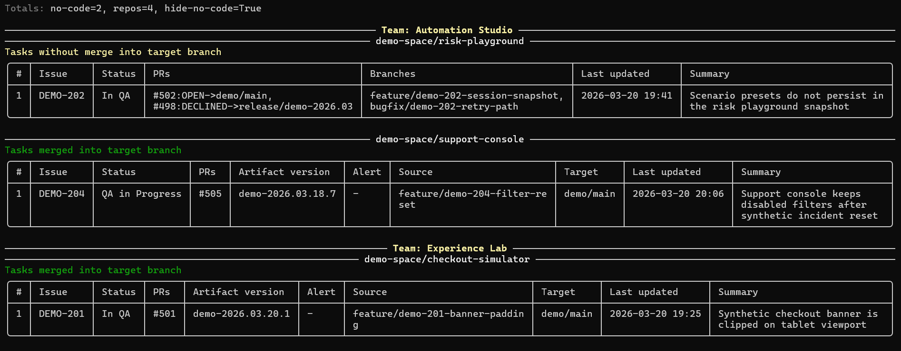
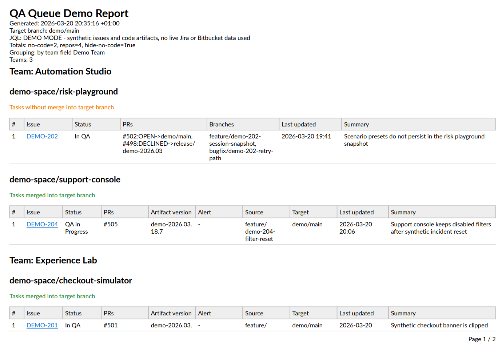
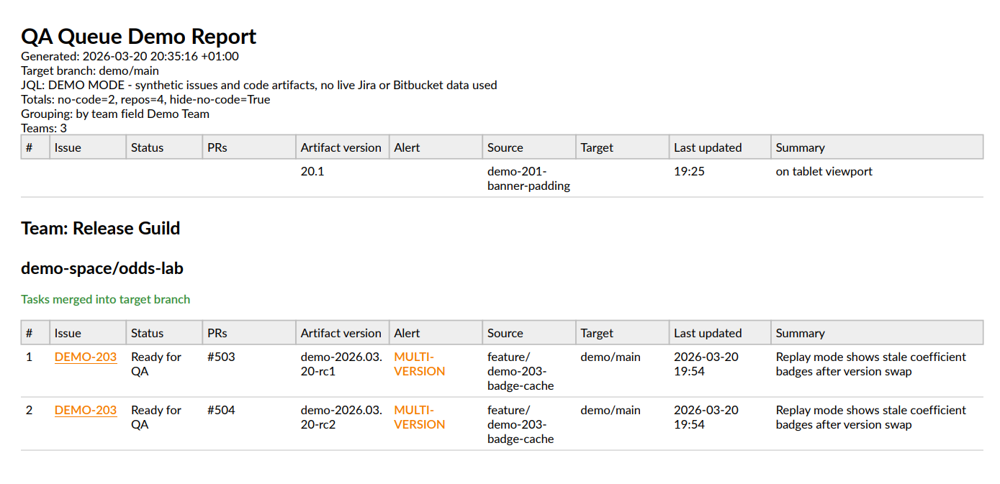
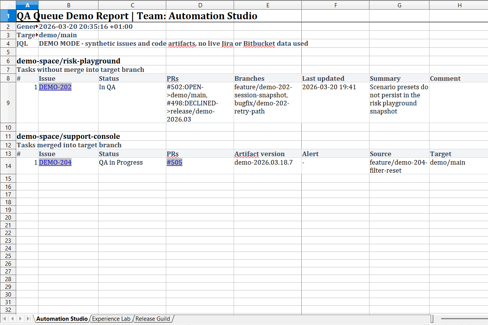

# QAQueueManager



`QAQueueManager` is a .NET console tool that builds a QA report from Jira issues and Bitbucket pull request data.

It is intended for teams that keep QA tasks in Jira and deliver code through Bitbucket repositories. The tool collects issues by JQL, detects which ones are linked to code, groups them by repository, checks whether the code was merged into the target branch, resolves artifact versions from Bitbucket tags, and exports the result to the console, PDF, and Excel.

## Features

- Loads Jira issues by custom JQL.
- Splits issues into:
  - issues without code links
  - issues linked to code through the Jira Development field
- Resolves repository and pull request information from Jira + Bitbucket.
- Checks whether each linked change was merged into the configured target branch.
- Resolves artifact version from tags attached to merge commits.
- Groups results by repository.
- Optionally groups results by team if a Jira team field is configured.
- Highlights multi-version cases when one issue is linked to more than one artifact version in the same repository.
- Prints interactive progress, including loaders and progress bars, in the console.
- Exports one PDF report.
- Exports one Excel workbook where sheets represent teams and rows include a `Comment` column for manual follow-up.

## Requirements

- .NET 10 SDK
- Jira access with permission to search issues and read development data
- Bitbucket access with permission to read pull requests, branches, and tags

## Configuration

Edit [`appsettings.json`](C:/Users/ntyulenev/Documents/Code/QAQueueManager/appsettings.json).

### Jira

- `BaseUrl`: Jira base URL, for example `https://your-company.atlassian.net`
- `Email`: Jira account email
- `ApiToken`: Jira API token
- `Jql`: JQL used to load QA issues
- `DevelopmentField`: Jira field name or id that stores development links
- `TeamField`: optional Jira field alias or a comma-separated list of aliases used for team grouping
- `MaxResultsPerPage`: Jira page size
- `RetryCount`: number of retries for Jira requests
- `BitbucketApplicationType`: development application type used when reading Jira dev-status data, usually `bitbucket`
- `PullRequestDataType`: development entity type used for pull requests in Jira dev-status, usually `pullrequest`
- `BranchDataType`: development entity type used for branches in Jira dev-status; keep the value that matches your Jira integration setup

### Bitbucket

- `BaseUrl`: Bitbucket API base URL
- `Workspace`: Bitbucket workspace name
- `AuthEmail`: Bitbucket account email
- `AuthApiToken`: Bitbucket app password or API token
- `RetryCount`: number of retries for Bitbucket requests

### Report

- `Title`: report title
- `TargetBranch`: branch used to validate merge status
- `PdfOutputPath`: output path for PDF export
- `ExcelOutputPath`: output path for Excel export
- `MaxParallelism`: maximum number of issues processed in parallel, default `4`
- `HideNoCodeIssues`: hides issues without code links when `true`
- `OpenAfterGeneration`: opens the generated PDF after run when `true`

## Example `appsettings.json`

```json
{
  "Jira": {
    "BaseUrl": "https://your-company.atlassian.net",
    "Email": "jira-user@your-company.com",
    "ApiToken": "jira-api-token",
    "Jql": "project = PLATFORM AND status in (\"QA in progress\", \"Quality Assurance\") ORDER BY updated DESC",
    "DevelopmentField": "Development",
    "TeamField": "Team[Dropdown],Teams[Checkboxes]",
    "MaxResultsPerPage": 100,
    "RetryCount": 3,
    "BitbucketApplicationType": "bitbucket",
    "PullRequestDataType": "pullrequest",
    "BranchDataType": "master"
  },
  "Bitbucket": {
    "BaseUrl": "https://api.bitbucket.org/2.0",
    "Workspace": "your-workspace",
    "AuthEmail": "bitbucket-user@your-company.com",
    "AuthApiToken": "bitbucket-api-token",
    "RetryCount": 3
  },
  "Report": {
    "Title": "QA Queue By Repository",
    "TargetBranch": "master",
    "PdfOutputPath": "qa-queue-report.pdf",
    "ExcelOutputPath": "qa-queue-report.xlsx",
    "MaxParallelism": 4,
    "HideNoCodeIssues": false,
    "OpenAfterGeneration": true
  },
  "Logging": {
    "LogLevel": {
      "Default": "Warning",
      "System.Net.Http.HttpClient": "Warning",
      "Microsoft": "Warning"
    }
  }
}
```

## Team Grouping

If `Jira:TeamField` is set, the report is grouped by team first and then by repository.

The value may contain multiple Jira field aliases separated by commas, for example:

```json
"TeamField": "Team[Dropdown],Teams[Checkboxes]"
```

If an issue belongs to multiple teams, it is shown in every relevant team section.

If `TeamField` is empty, the report is grouped only by repository.

## Outputs

### Console

The console output includes:

- progress bars for data loading and processing
- issues without code links
- repositories with tasks not merged into the target branch
- repositories with merged tasks sorted by artifact version

### PDF

The PDF contains the same report structure as the console view.

- Jira issue keys are clickable links
- multi-version rows are highlighted

### Excel

The Excel export is a single workbook.

- sheets represent teams
- each sheet is organized service by service
- every task row contains a `Comment` column for manual notes
- Jira issue keys are hyperlinks
- pull request links are included when available

### Output Examples









## Run

```powershell
dotnet run
```

To build only:

```powershell
dotnet build
```

## Notes

- Artifact versions are resolved from Bitbucket tags attached to merge commits.
- If no tag is found for a merged change, the report shows `Version not found`.
- Excel sheet names are trimmed automatically to fit Excel limits.
- `OpenAfterGeneration` currently opens the PDF output after the run.
